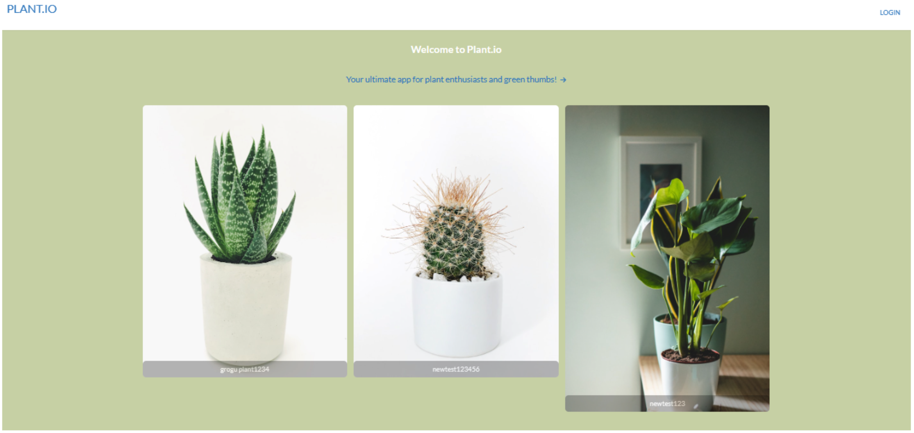

# Project 3: Plant.io

## Description

Plant.io is an application that allows plant lovers and gardening enthusiasts to be part of a community and share their experiences with growing and maintaining their favourite plants. On the homepage of the site, the user can browse existing profiles. Users can create an account to upload pics of their plants along with the plant's care requirements. Once signed up, users will have access to their dashboard which only shows their own plants. From the dashboard, they can update or edit existing plant profiles. Clicking on a plant profile will provide an image of the plant and details on plant care requirements such as watering, sun exposure, humidity and temperature. Keep your plants alive with Plant.io!

## Table of Contents

- [Installation](#installation)
- [Screenshots](#screenshots)
- [Deployed Application](#deployed-application)
- [Usage](#usage)
- [Credits](#credits)
- [License](#license)

## Installation

N/A

## Screenshots

* Homepage

* Login Page 

* Single Plant

* Add Plant

## Deployed Application

coming soon!

## Usage

- View existing plant profiles on the homepage.
- Click on "Login" to login or sign up.
- Users must sign in to create/update/delete plant profiles.

## Credits

kcl20

xinnnan Xinnan

m1xzo

jveyhl

Stripe code from: https://medium.com/@kickbeck/stripe-client-side-donation-button-with-react-64730cf40f14

## License

Please refer to the LICENSE in the repo.
